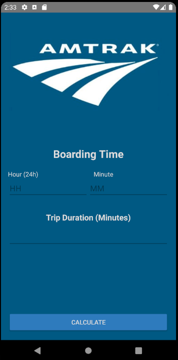

# Amtrak App

## Description
This repo contains my submission for the Amtrak Android Application. This app calculates train arrival time for trains.

## Assignment

In this app you will use persistent data to determine a train's arrival time after you enter the boarding time and length of trip.

Specifications:

1. The app should start with a picture of the Amtrak logo and a title. This activity should request:
  - The boarding time with a separate input for the hour and minutes on a 24-hour clock
  - The length of the entire train trip in minutes
    - Store all three values
  - The second screen should show the arrival time of the train by hour and minutes of a 24-hour clock. Pull the train trip in minutes from persistent storage to make this determination.
  - If the arrival is past midnight, display the message "Red-Eye Arrival" in addition to an appropriate image
  - Select your own images by searching the web
  - The maximum hour entered for the boarding time is 23 and the minutes is 59
  - The maximum number of minutes for length of travel entered is 1500 minutes
