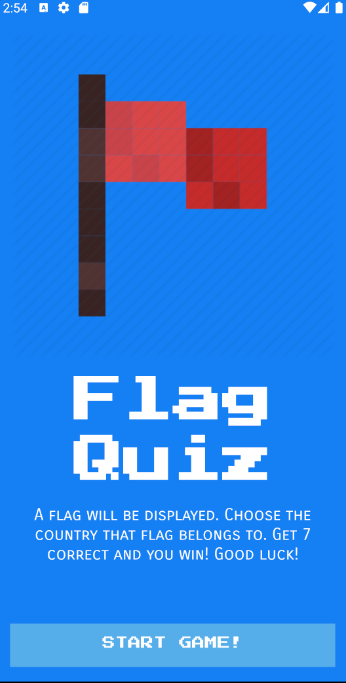

# Flag Quiz

## Description
This repo contains my submission for the Flag Quiz Application. This app is a game that shows random 10 flags and asks the user which country that flag belongs to. If the user gets more than 7 correct, they win!

## Assignment

In this app you will use persistent data to determine a train's arrival time after you enter the boarding time and length of trip.

Specifications:

In this app you will build a 10 question quiz game on flags of the world.  You will need to choose which ten flags you want to use. 

Functionality:

* The opening screen displays and explains the quiz/game. There should be a button that allows the user to start
* You will show a flag to the user and allow them to select the correct answer.  It's up to you on how you present the correct answers. 
* Once an answer is selected, record the answer and move to the next question, repeat this for all questions.
* Your app will track the number of right answers and present a score out of 10 at the end.
* Implement audio into your app by having right/wrong answer sounds on your questions or a success/failure noise at the end of the game with the score. 

Think about good presentation and adding elements to the UI to help it look professional and polished. Remember that the midterm project is 30% of the total course grade!

You will present your project in class.
