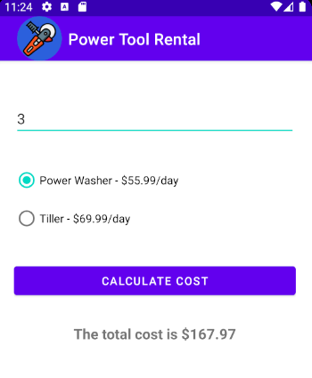

# Power Tool Rental App

## Description
This repo contains my submission for the Power Tool Rental Android Application. It contains calculations for power tool rentals and custom icons.

## Assignment

Algorithms: 

- The opening screen requests the number of days that the power tool will be rented.
- The user selects a radio button labeled Power Washer or Tiller and then selects the Compute Cost Button.
- The final cost is displayed for the number of days rented.

Conditions:

- The result is rounded off to the nearest penny.
- The power washer costs $55.99 a day and the tiller $68.99 a day
- Do not enter more than seven days.
- Locate ann image online and resize it for use as a custom launcher icon and Action bar icon. 
